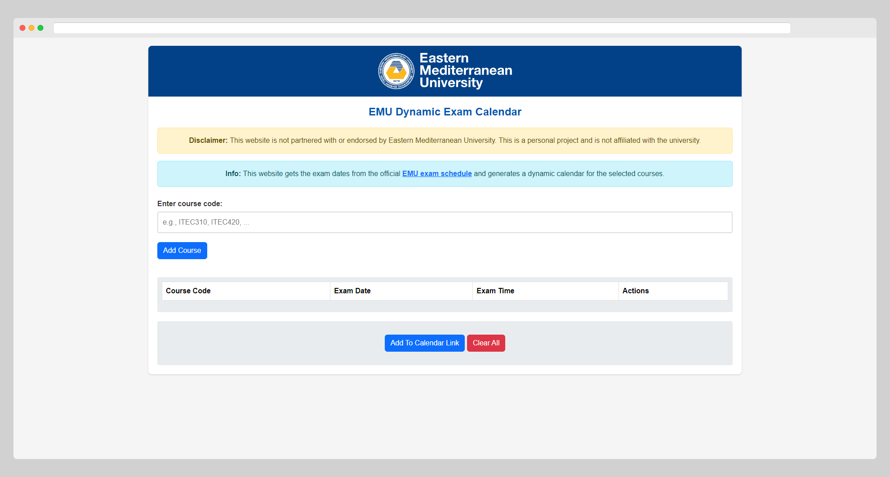

# EMU Dynamic Exam Calendar

## Overview

The EMU Exam Scheduler is a convenient tool designed to simplify the process of keeping track of your exam schedules at Eastern Mediterranean University (EMU). By leveraging the official EMU exam schedule, this system automatically generates iCal files for the selected courses, enabling users to seamlessly integrate their exam dates into their preferred calendar applications.

## Features

- Automatic Updates: The system fetches the latest exam schedule information directly from the official EMU sources, ensuring that your calendar is always up-to-date.

- Generated iCal files can be easily added to popular calendar apps such as Google Calendar, Apple Calendar, Outlook, and more, allowing for smooth synchronization across devices.

## Screenshot

## Contributing

Contributions to the EMU Exam Scheduler are welcome! If you have ideas for new features, bug fixes, or improvements, feel free to submit a pull request. Please ensure that your code adheres to the established coding standards and practices.
